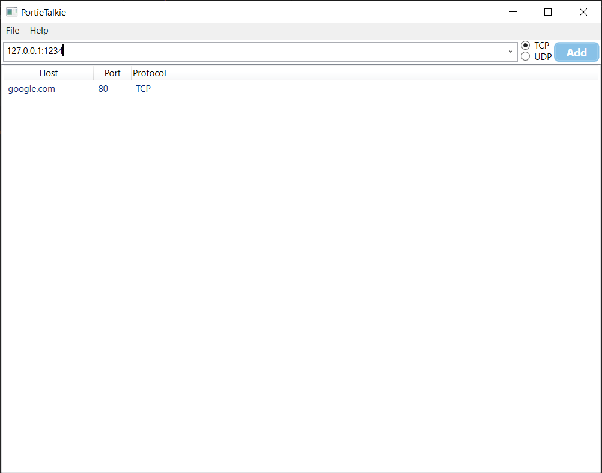
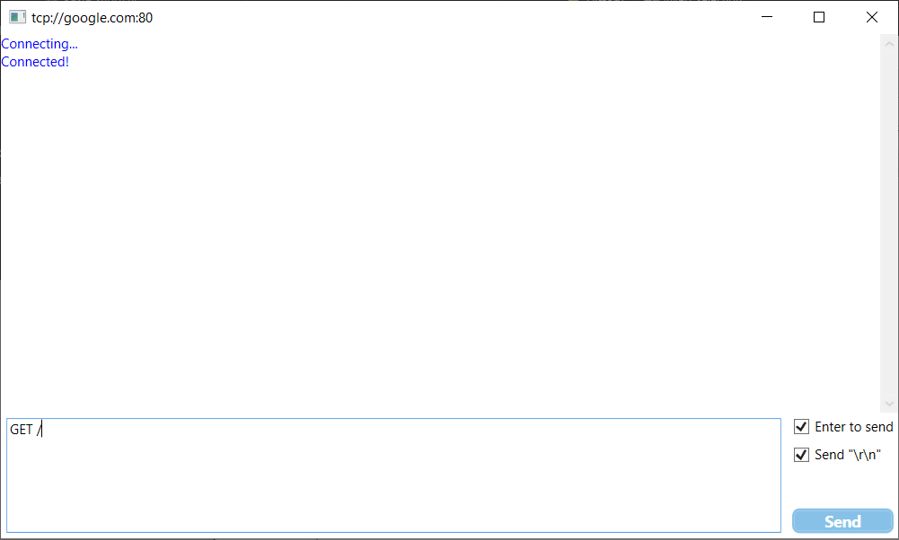
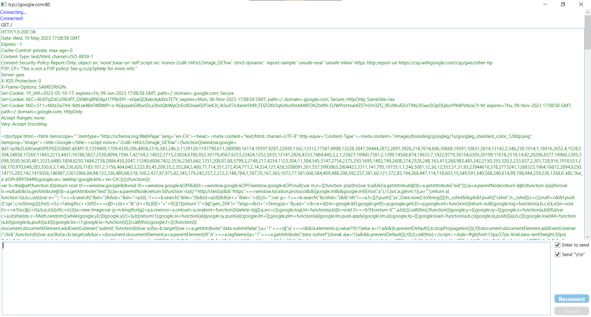
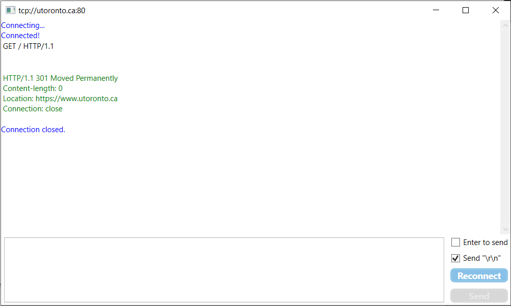

# PortieTalkie

PortieTalkie is a lightweight .NET 6.0 tool intended for testing TCP/IP and UDP applications in a straightforward and visual way, but it also makes for a great learning tool to observe how different internet applications, especially servers, behave.

[Pre-release build (.ZIP)](https://github.com/hashXen/PortieTalkie/files/11444675/portietalkie-0.1.0.zip)

You can "talk" to both TCP and UDP services with PortieTalkie!
Add services by putting down the host and port delimited by ":" in the ComboBox.

After double clicking on a service, a familiar "chat window" will appear for you to talk to the service.

Getting flooded by Google's response is always fun.

Use it to closely observe the behavior of a server!
This is how University of Toronto upgrades to HTTPS. (With a 301 request)

You can keep and save lists of the services you want to connect to in a list to save you from the trouble of adding them every time! PortieTalkie always saves your "workspace" by default when you exit.

Goals for the project in the future includes embedding a binary viewer/editor for testing non-plaintext communication protocols, implementing a script parser for user-defined behaviors for efficiency, etc.
